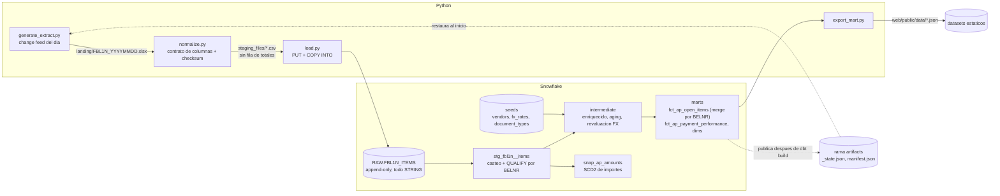

# Pipeline ELT incremental de cuentas a pagar

Pipeline diario que ingesta el extracto de partidas individuales de acreedores
de SAP FI-AP (transaccion **FBL1N**), lo modela en Snowflake con dbt y deja
los agregados listos para un tablero estatico.

Los datos son sinteticos. El generador esta versionado en el repo como prueba
de procedencia.

---

## Que problema resuelve

FBL1N no expone un feed de cambios: es una pantalla. Lo que se exporta todos
los dias es un archivo con las partidas que se movieron ese dia. Eso lo
convierte en un **change feed**, no en un snapshot:

| Lo que trae el extracto | Lo que obliga a hacer |
|---|---|
| El mismo `BELNR` vuelve con datos distintos cuando se corrige o se compensa | RAW guarda todas las versiones y el estado actual se resuelve con `QUALIFY` |
| Una compensacion es un UPDATE sobre una partida que ya se cargo | Un delta de solo altas no alcanza |
| Documentos con `BUDAT` de 15 a 45 dias atras | El filtro incremental no puede ir por fecha contable |
| `VERZN` lo calcula el report al ejecutarse | El aging se recalcula contra la fecha de corte del ledger |
| Tres monedas de documento y una moneda local | Toda metrica agregada va en `DMBTR` |
| Una fila de totales al pie, con `*` en moneda de documento | Checksum contra moneda local, y la fila no llega a RAW |

Cada una de estas decisiones esta desarrollada en
[docs/DECISIONS.md](docs/DECISIONS.md), con las alternativas que descarte.

---

## Flujo



La orquestacion es GitHub Actions, sin Airflow ni Dagster: el DAG es lineal,
tiene una sola fuente y cinco pasos.

---

## Mapeo del extracto: encabezado en espanol a campo SAP

El extracto se exporta con la variante de layout de FBL1N en espanol. El orden
de las 21 columnas es parte del contrato: `normalize.py` lo valida contra
`config.COLUMNS` antes de leer una sola fila.

| # | Encabezado en el xlsx | Campo SAP | Uso en el pipeline |
|---|---|---|---|
| 1 | Icono part.abiertas/comp. | `ICON_STATUS` | Vacio en el detalle; en la fila de totales trae el marcador `@5C\QPendientes@` |
| 2 | Acreedor | `LIFNR` | Clave hacia `vendors` (texto, no numero) |
| 3 | Clave de referencia | `KIDNO` | Estable entre re-emisiones |
| 4 | Referencia | `XBLNR` | Referencia del proveedor |
| 5 | Nº documento | `BELNR` | Clave del merge y del `QUALIFY` |
| 6 | Clave referencia 1 | `XREF1` | Siempre vacio en esta variante |
| 7 | Vía de pago | `ZLSCH` | Siempre vacio en esta variante |
| 8 | Bloqueo de pago | `ZLSPR` | Siempre vacio en esta variante |
| 9 | Demora tras vencimiento neto | `VERZN` | Calculo del report, no confiable: `verzn_report_unreliable` |
| 10 | Importe en moneda doc. | `WRBTR` | No se agrega entre monedas |
| 11 | Moneda del documento | `WAERS` | `ARS`, `USD`, `EUR` |
| 12 | Importe en moneda local | `DMBTR` | Importe de referencia de toda metrica agregada |
| 13 | Moneda local | `HWAER` | Siempre `ARS` |
| 14 | Fecha de documento | `BLDAT` | Fecha de la cotizacion del documento |
| 15 | Fe.contabilización | `BUDAT` | Llega atrasada en los late-arriving |
| 16 | Vencimiento neto | `NETDT` | Base del aging |
| 17 | Fecha compensación | `AUGDT` | Nula = partida abierta |
| 18 | Doc.compensación | `AUGBL` | Compartido por las partidas de un mismo lote de pago |
| 19 | Clase de documento | `BLART` | `KR`, `RE`, `KG`, `KZ` |
| 20 | Nombre del usuario | `USNAM` | Usuario que contabilizo |
| 21 | Cta.contrapartida | `GKONT` | Cuenta de mayor de contrapartida |

Las fechas llegan a RAW como texto `DD.MM.YYYY`, tal como las muestra SAP. El
unico lugar que castea es `stg_fbl1n__items`.

---

## Numeros verificados

### Dataset base

`scripts/enrich_baseline.py` genera el extracto inicial con semilla fija:

- 5.000 partidas, ledger al 2026-07-08.
- 40 acreedores con distribucion Pareto: los 5 primeros concentran cerca del
  57% del volumen.
- Clases de documento: `KR` 3.768, `RE` 728, `KZ` 285, `KG` 219. `KR` y `RE`
  van con signo negativo (haber); `KG` y `KZ`, positivo (debe).
- Moneda de documento: ARS 70%, USD 20%, EUR 10%. `WRBTR = DMBTR / cotizacion`
  a `BLDAT`.
- Total: -21.945.446.773,62 ARS.
- Aging de abiertas: 959 no vencidas, 656 de 1 a 30 dias, 667 de 31 a 60, 661
  de 61 a 90 y 688 de mas de 90.

### Cierre del backfill (61 dias, 2026-07-08 a 2026-09-06)

- 6.827 documentos distintos en RAW.
- 1.837 documentos con mas de una version. `unique_stg_fbl1n__items_belnr` pasa:
  el `QUALIFY` las resuelve.
- `dbt build`: PASS=157, ERROR=0 (11 modelos, 1 snapshot, 3 seeds, 142 tests).
- `snap_ap_amounts`: 6.827 filas, sin historia SCD2. Un backfill en un solo
  build no siembra historia ([ADR-011](docs/DECISIONS.md)).

### Primeras corridas del workflow (ledger al 2026-09-12, consultado el 2026-09-13)

| | |
|---|---|
| Extractos cargados | 67 |
| Filas en RAW | 9.023 |
| Documentos | 7.002 (3.631 abiertos) |
| Documentos con mas de una version | 2.012 |
| Filas por feed diario (07/09 a 12/09) | 61, 66, 50, 78, 51, 46 |
| `dbt build` en Actions | PASS=157, ERROR=0 |
| `snap_ap_amounts` | 7.004 filas, 2 versiones cerradas |
| Revaluacion cambiaria de abiertas en USD y EUR | -182.838.690,63 ARS |
| Reintento de una corrida ya cargada | 0 archivos procesados, 0 filas duplicadas |

---

## Como correrlo

### 1. Snowflake

Generar el par de claves RSA **fuera del repo** (`*.p8` y `*.pem` estan en
`.gitignore`):

```bash
openssl genrsa 2048 | openssl pkcs8 -topk8 -inform PEM -out rsa_key.p8 -nocrypt
openssl rsa -in rsa_key.p8 -pubout -out rsa_key.pub
```

Ejecutar `sql/00_setup_account.sql` con `ACCOUNTADMIN`, reemplazando
`<<RSA_PUBLIC_KEY>>` por el contenido de `rsa_key.pub` sin las lineas
`BEGIN`/`END`. Despues, `sql/01_setup_raw.sql` con el rol `AP_PIPELINE`. Crean
el usuario de servicio `AP_PIPELINE_SVC` (`TYPE = SERVICE`, sin password), el
warehouse `AP_WH` (XS, `AUTO_SUSPEND = 60`, resource monitor de 10 creditos por
mes), la base `AP_ANALYTICS`, el stage, el file format y la tabla RAW.

### 2. Entorno local (Windows, PowerShell)

```powershell
python -m venv .venv
.venv\Scripts\activate
pip install -r requirements.txt
copy .env.example .env
```

Completar `.env` segun `.env.example`. La clave va por
`SNOWFLAKE_PRIVATE_KEY_PATH`. `LANDING_DIR`, `STAGING_DIR` y `WEB_DATA_DIR` van
vacias para usar las rutas del repo.

### 3. Correr el pipeline

Los scripts de Python cargan `.env` solos. dbt no: antes de cualquier comando
dbt hay que exportar las variables a la sesion.

```powershell
python generate_extract.py        # feed del dia siguiente a last_run_date
python normalize.py               # valida contrato y checksum, escribe los CSV
python load.py                    # PUT + COPY INTO a RAW

. .\scripts\load_env.ps1          # punto y espacio: deja las variables en la sesion
cd dbt_ap
dbt deps
dbt build                         # seeds, snapshot, modelos y tests
cd ..

python export_mart.py             # datasets JSON en web/public/data
```

`normalize.py` y `load.py` sin argumentos procesan todo lo pendiente en orden
cronologico. `load.py --dry-run` y `export_mart.py --dry-run` imprimen el SQL
sin conectarse.

### 4. Generar mas dias

El generador continua el ledger desde `landing/_state.json` y se niega a emitir
un extracto con fecha futura. Es idempotente por fecha: el RNG se siembra con
`(semilla, fecha)`, asi que la misma fecha produce el mismo archivo.

El `_state.json` versionado en `main` es el estado inicial (2026-09-06). El
vigente lo publica cada corrida del workflow en la rama `artifacts`. Para
generar en local sin divergir del ledger que ya esta en Snowflake, primero hay
que traer ese estado (y no commitearlo en `main`):

```powershell
git fetch origin artifacts
git show origin/artifacts:state/_state.json > landing/_state.json
```

```powershell
python generate_extract.py --days 5             # 5 dias desde last_run_date
python generate_extract.py --until 2026-09-20   # hasta esa fecha inclusive
```

`--date` genera una fecha puntual y solo es seguro para el dia siguiente a
`last_run_date`: si hay un hueco, el feed se arma sin los documentos de los dias
que faltan.

### 5. Un modelo o un test puntual

```powershell
cd dbt_ap
dbt build --select fct_ap_open_items
dbt test --select assert_mart_reconciles_with_raw
```

---

## CI/CD

**`pipeline.yml`** corre con cron `0 9 * * 1-5` (06:00 en Buenos Aires), con
push a `main` y a mano con `workflow_dispatch`:

1. Restaura `_state.json` desde la rama `artifacts`.
2. Genera desde `last_run_date + 1` hasta ayer en hora argentina. El lunes
   genera viernes, sabado y domingo, y una segunda corrida el mismo dia no
   genera nada.
3. Normaliza, carga y corre `dbt build --target ci`.
4. Publica `_state.json`, `manifest.json` y `run_results.json` en `artifacts`.
   Si no hay commit o el push falla, el job termina en rojo. Ese commit mantiene
   activo el repo: GitHub deshabilita los cron tras 60 dias sin actividad.
5. Exporta los datasets y los commitea en `main` con `[skip ci]`.

La configuracion llega por secrets del repositorio: `SNOWFLAKE_ACCOUNT`,
`SNOWFLAKE_USER`, `SNOWFLAKE_ROLE`, `SNOWFLAKE_WAREHOUSE`,
`SNOWFLAKE_DATABASE`, `SNOWFLAKE_SCHEMA_RAW`, `SNOWFLAKE_SCHEMA_ANALYTICS`,
`SNOWFLAKE_STAGE`, `SNOWFLAKE_FILE_FORMAT`, `SNOWFLAKE_RAW_TABLE` y
`SNOWFLAKE_PRIVATE_KEY` (el PEM completo). En el runner no se define
`SNOWFLAKE_PRIVATE_KEY_PATH`.

**`ci.yml`** corre en cada pull request, sin conexion a Snowflake: `ruff`,
`sqlfluff` con templater jinja, `dbt deps` y `dbt parse`.

---

## Tests

142 tests de dbt: `unique` y `not_null` en claves, `relationships` a las
dimensiones y a los maestros, `accepted_values` en `BLART`, `WAERS` y `HWAER`,
y cuatro tests singulares. La freshness de RAW esta declarada en la source; se
chequea con `dbt source freshness`, que `dbt build` no ejecuta.

| Test | Que protege |
|---|---|
| `assert_posting_date_after_document_date` | `BUDAT >= BLDAT` en toda fila |
| `assert_no_verzn_on_cleared_items` | `VERZN` poblado si y solo si la partida esta abierta |
| `assert_mart_reconciles_with_raw` | La mart cuadra contra RAW deduplicado, con tolerancia de un centavo |
| `assert_clearing_date_not_after_extract` | Ningun `AUGDT` posterior a su `_extract_date` |

---

## Seguridad

- Ninguna credencial en el codigo, en comentarios ni como default de
  `os.environ.get()`. Si falta una variable, el proceso aborta antes de conectarse.
- Autenticacion por key-pair RSA. El usuario de servicio no acepta password.
- `profiles.yml` resuelve todo por `env_var()` sin fallback.
- `.env`, `*.p8` y `*.pem` estan en `.gitignore`. `scripts/load_env.ps1` y
  `scripts/diagnose_auth.py` nunca imprimen valores.

---

## Estructura

```
config.py               contrato del layout, rutas y lectura de entorno
generate_extract.py     change feed diario
normalize.py            xlsx -> csv, contrato y checksum
load.py                 PUT + COPY INTO append-only
export_mart.py          marts -> JSON estatico
landing/                extracto versionado del 2026-09-06 y _state.json
scripts/                load_env.ps1, diagnose_auth.py, enrich_baseline.py
sql/                    setup de cuenta y RAW, COPY de referencia, teardown
dbt_ap/                 proyecto dbt
docs/DECISIONS.md       decisiones de diseno (ADRs)
web/                    tablero Next.js que lee los JSON (sin desplegar)
.github/workflows/      pipeline.yml y ci.yml
```
